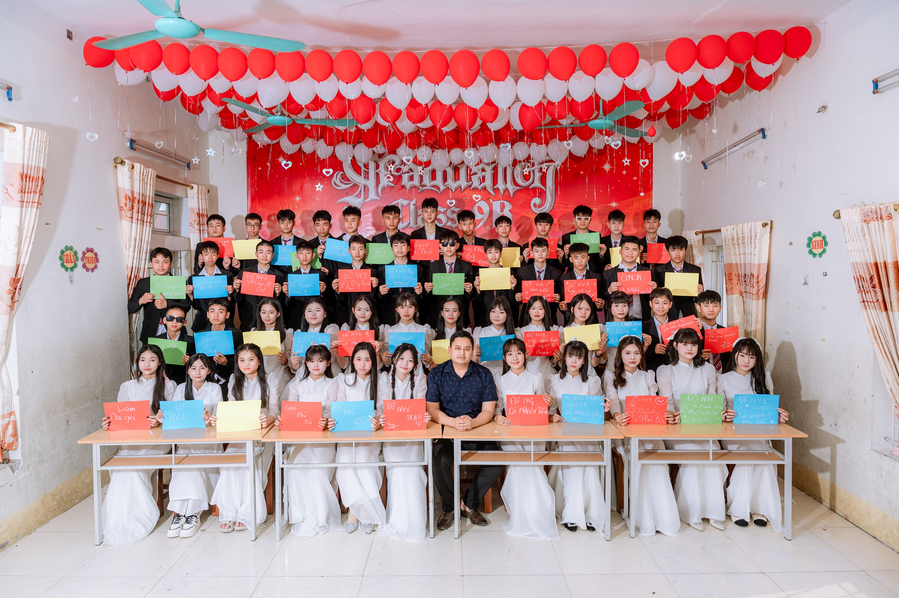
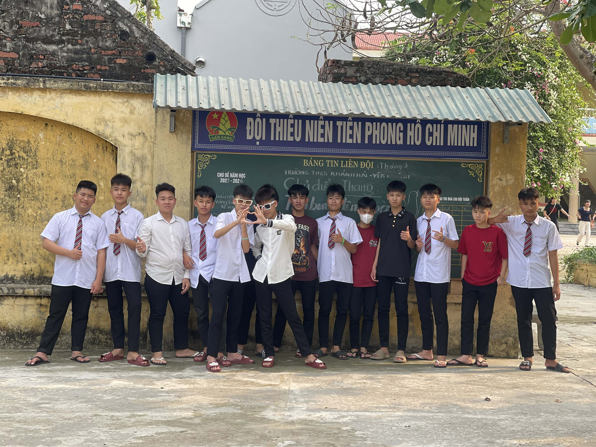

<div align="center">

# 🎓 HÀNH TRÌNH & ƯỚC MƠ | MEMORIES & PORTFOLIO WEBSITE


<br/>

**Trang web lưu giữ kỷ niệm 4 năm cấp 2, tình bạn lớp 9B & khát vọng cống hiến màu xanh áo lính**

[📌 Tổng Quan](#-tổng-quan-dự-án) • [🌟 Tính Năng](#-các-tính-năng-nổi-bật) • [🎨 UI/UX](#-thiết-kế--trải-nghiệm-người-dùng) • [🛠️ Công Nghệ](#️-công-nghệ-sử-dụng) • [📂 Cấu Trúc](#-cấu-trúc-dự-án) • [💻 Source Code](#-full-source-code-indexhtml) • [🤝 Tác Giả](#-tác-giả--đóng-góp)

---

</div>

## 📌 Tổng Quan Dự Án

Website **"Hành Trình & Ước Mơ"** là một tác phẩm web kỷ niệm đầy nghệ thuật và cảm xúc được thiết kế, lập trình chỉn chu bởi **Minh Fansub PTL**. 

Trang web là nơi đóng băng khoảnh khắc:
- 🌸 **4 năm thanh xuân:** Hành trình từ những ngày đầu bỡ ngỡ bước vào lớp 6 cho đến chặng đường miệt mài ôn thi chuyển cấp.
- 🏫 **Tập thể Lớp 9B:** Từ những học sinh quậy phá, hồn nhiên đến một tập thể đoàn kết, gắn bó như gia đình.
- 💻 **Tình bạn DEV:** Mối duyên lập trình cùng người anh em đồng hành **Phạm Bùi Tiến Đạt (PBTĐ1)**.
- 🎖️ **Khát vọng Quân nhân:** Ước mơ cháy bỏng được đứng trong hàng ngũ Quân đội Nhân dân Việt Nam, kết hợp tư duy công nghệ và ý chí thép của người lính.

---

## 🌟 Các Tính Năng Nổi Bật

### 🎬 1. Màn Hình Chờ Tương Tác (Interactive Enter Overlay)
- Lớp phủ mờ tối sang trọng (`rgba(15, 23, 42, 0.6)`) tích hợp hiệu ứng `backdrop-filter: blur(12px)`.
- Chữ nhấp nháy chuyển động nhịp nhàng (`pulseText` animation).
- Yêu cầu người dùng tương tác để mở khóa thanh cuộn và tự động kích hoạt âm thanh nền (khắc phục chính sách Autoplay Policy của các trình duyệt hiện đại).

### 🎵 2. Phát Nhạc Nền Tự Động (Background Audio API)
- Tích hợp bài hát tuyển tập tuổi học trò đong đầy cảm xúc.
- Âm lượng được làm dịu nhẹ (50%) tạo không gian lắng đọng khi đọc nội dung.

### 🌌 3. Hero Section Chuyển Màu & Hạt Bụi Động (Floating Particles)
- Nền Gradient chuyển màu chéo liên tục 15 giây mượt mà.
- Hệ thống hạt bụi ánh sáng ngẫu nhiên được khởi tạo bằng JavaScript (`Math.random()`), bay bổng tự do trên màn hình.

### 📜 4. Scroll Reveal Animations (Hiệu Ứng Cuộn Trang)
- Tối ưu hiệu năng tuyệt đối bằng **`IntersectionObserver` API** thay vì dùng sự kiện `window.onscroll`.
- Các khối nội dung bay vào mượt mà từ các hướng: `hidden-up`, `hidden-left`, `hidden-right`.

### 🖼️ 5. Hiệu Ứng Hình Ảnh Lấp Lánh (Shimmer & Hover Zoom)
- Khung ảnh thiết kế bo góc, đổ bóng nổi 3D (`box-shadow`).
- Hiệu ứng vệt sáng quét ngang (Shimmer Glass Effect) khi di chuột qua ảnh.
- Phóng to ảnh nhẹ nhàng (`scale(1.05)`) mang lại cảm giác sống động.

---

## 🎨 Thiết Kế & Trải Nghiệm Người Dùng

| Bảng Màu (Palette) | Mã Màu (HEX) | Vai Trò |
| :--- | :--- | :--- |
| **Primary Color** | `#1a365d` | Màu xanh Navy đại diện cho kỷ luật, chiều sâu và sự thanh lịch |
| **Accent Color** | `#3182ce` | Màu xanh lam công nghệ đại diện cho nhiệt huyết và tuổi trẻ |
| **Background Gray** | `#f8fafc` | Màu xám nhạt đan xen tạo sự phân chia mảng khối rõ ràng |
| **Text Main** | `#2d3748` | Màu chữ tối giúp mắt dễ chịu khi đọc văn bản dài |

- **Typography Premium:**
  - Standard Heading: **Playfair Display** (Font Serif mang nét cổ điển, trang trọng).
  - Body Text: **Inter** (Font Sans-serif hiện đại, tối ưu hiển thị trên màn hình kỹ thuật số).

---

## 🛠️ Công Nghệ Sử Dụng

- **Frontend Core:** HTML5 Semantic, CSS3 Custom Properties (Variables), Vanilla JavaScript (ES6+).
- **Web APIs:** `IntersectionObserver`, `HTMLAudioElement`, `DOM Manipulation`.
- **Fonts & Visuals:** Google Fonts, Pure CSS Animations, SVG/CSS Keyframes.
- **Optimization:** Không phụ thuộc jQuery hay bất kỳ thư viện ngoài nào (Zero Dependencies).

---

## 📂 Cấu Trúc Dự Án

```text
├── index.html                  # File HTML/CSS/JS chính (Full Source Code)
├── FLY04186.jpg                # Bức ảnh kỷ niệm tập thể Lớp 9B
├── FLY03892.jpg                # Bức ảnh chân dung & Khát vọng Quân nhân
├── LPA02750.jpg                # Bức ảnh bộ đôi DEV (Minh Fansub PTL & Phạm Bùi Tiến Đạt)
├── 306e983b-3d62-40f0-97fa... # Bức ảnh Hội anh em chí cốt
└── README.md                   # Tài liệu hướng dẫn & giới thiệu dự án
```

---

## 🚀 Hướng Dẫn Cài Đặt & Chạy Local

### Bước 1: Tải mã nguồn
Lưu file mã nguồn bên dưới thành `index.html` hoặc clone repository về máy:
```bash
git clone [https://github.com/minhfansubdev/hanh-trinh-uoc-mo.git](https://github.com/minhfansubdev/hanh-trinh-uoc-mo.git)
cd hanh-trinh-uoc-mo
```

### Bước 2: Thêm hình ảnh
Đặt 4 file ảnh của bạn vào cùng thư mục chứa file `index.html`:
- `FLY04186.jpg`
- `FLY03892.jpg`
- `LPA02750.jpg`
- `306e983b-3d62-40f0-97fa-d82ec3d943a4.jpg`

### Bước 3: Thưởng thức
Double-click vào file `index.html` để mở bằng bất kỳ trình duyệt nào (Chrome, Edge, Firefox, Brave, Safari).

---

## 💻 Full Source Code (`index.html`)

<details open>
<summary><b>🔥 Click vào đây để mở/đóng mã nguồn đầy đủ của file index.html</b></summary>

```html
<!DOCTYPE html>
<html lang="vi">
<head>
    <meta charset="UTF-8">
    <meta name="viewport" content="width=device-width, initial-scale=1.0">
    <title>Hành Trình & Ước Mơ | Minh Fansub PTL</title>
    <link href="[https://fonts.googleapis.com/css2?family=Inter:wght@300;400;600;700&family=Playfair+Display:ital,wght@0,600;1,600&display=swap](https://fonts.googleapis.com/css2?family=Inter:wght@300;400;600;700&family=Playfair+Display:ital,wght@0,600;1,600&display=swap)" rel="stylesheet">
    <style>
        :root {
            --primary-color: #1a365d; 
            --accent-color: #3182ce;
            --text-main: #2d3748;
            --text-light: #718096;
            --bg-white: #ffffff;
            --bg-gray: #f8fafc;
        }

        * {
            margin: 0;
            padding: 0;
            box-sizing: border-box;
        }

        /* Khóa cuộn trang khi chưa click vào mành hình chờ */
        body {
            font-family: 'Inter', sans-serif;
            color: var(--text-main);
            background-color: var(--bg-white);
            line-height: 1.7;
            overflow: hidden; /* Sẽ được mở lại bằng JS sau khi click */
        }

        /* ================= MÀN HÌNH CHỜ (OVERLAY) ================= */
        #enterOverlay {
            position: fixed;
            top: 0;
            left: 0;
            width: 100vw;
            height: 100vh;
            background: rgba(15, 23, 42, 0.6); /* Nền tối mờ */
            backdrop-filter: blur(12px); /* Làm mờ khung cảnh phía sau */
            -webkit-backdrop-filter: blur(12px);
            z-index: 10000;
            display: flex;
            justify-content: center;
            align-items: center;
            flex-direction: column;
            color: #fff;
            cursor: pointer;
            transition: opacity 1s ease, visibility 1s ease;
        }

        #enterOverlay.hidden {
            opacity: 0;
            visibility: hidden;
        }

        .enter-content {
            text-align: center;
            animation: pulseText 2s infinite ease-in-out;
        }

        .enter-content h2 {
            font-family: 'Playfair Display', serif;
            font-size: 2.5rem;
            margin-bottom: 15px;
            letter-spacing: 2px;
        }

        .enter-content p {
            font-size: 1.2rem;
            letter-spacing: 5px;
            text-transform: uppercase;
            color: #93c5fd;
        }

        @keyframes pulseText {
            0%, 100% { transform: scale(1); opacity: 0.8; }
            50% { transform: scale(1.05); opacity: 1; text-shadow: 0 0 20px rgba(147, 197, 253, 0.6); }
        }

        /* ========================================================== */

        /* Hero Section */
        .hero {
            position: relative;
            background: linear-gradient(-45deg, #fdfbfb, #ebedee, #e2e8f0, #fdfbfb);
            background-size: 400% 400%;
            animation: gradientBG 15s ease infinite;
            padding: 120px 20px;
            text-align: center;
            border-bottom: 1px solid #e2e8f0;
            overflow: hidden;
            min-height: 80vh;
            display: flex;
            align-items: center;
            justify-content: center;
        }

        @keyframes gradientBG {
            0% { background-position: 0% 50%; }
            50% { background-position: 100% 50%; }
            100% { background-position: 0% 50%; }
        }

        .particle {
            position: absolute;
            border-radius: 50%;
            background: rgba(49, 130, 206, 0.1);
            animation: float 8s infinite ease-in-out alternate;
        }

        @keyframes float {
            0% { transform: translateY(0) scale(1); }
            100% { transform: translateY(-40px) scale(1.2); }
        }

        .hero-content {
            position: relative;
            z-index: 2;
        }

        .hero h1 {
            font-family: 'Playfair Display', serif;
            font-size: 3.8rem;
            color: var(--primary-color);
            margin-bottom: 20px;
        }

        .hero p {
            font-size: 1.2rem;
            color: var(--text-light);
            max-width: 700px;
            margin: 0 auto;
        }

        /* Container & Layout */
        .container {
            max-width: 1100px;
            margin: 0 auto;
            padding: 100px 20px;
        }

        .bg-light-gray {
            background-color: var(--bg-gray);
        }

        .section-title {
            text-align: center;
            font-size: 2.8rem;
            color: var(--primary-color);
            margin-bottom: 50px;
            font-family: 'Playfair Display', serif;
            position: relative;
        }

        .section-title::after {
            content: '';
            width: 60px;
            height: 4px;
            background: linear-gradient(90deg, var(--primary-color), var(--accent-color));
            display: block;
            margin: 15px auto 0;
            border-radius: 2px;
            transition: width 0.5s ease;
        }

        .section-title:hover::after {
            width: 120px;
        }

        .row {
            display: flex;
            align-items: center;
            gap: 60px;
            margin-bottom: 40px;
        }

        .row.reverse {
            flex-direction: row-reverse;
        }

        .col-img, .col-text {
            flex: 1;
        }

        .img-wrapper {
            position: relative;
            overflow: hidden;
            border-radius: 16px;
            box-shadow: 0 20px 40px rgba(0,0,0,0.08);
            border: 5px solid #fff;
        }

        .img-wrapper img {
            width: 100%;
            display: block;
            transition: transform 0.8s cubic-bezier(0.25, 1, 0.5, 1);
        }

        .img-wrapper::before {
            content: '';
            position: absolute;
            top: 0; left: -100%; width: 50%; height: 100%;
            background: linear-gradient(to right, rgba(255,255,255,0) 0%, rgba(255,255,255,0.4) 50%, rgba(255,255,255,0) 100%);
            transform: skewX(-25deg);
            z-index: 1;
            transition: left 0.8s ease;
        }

        .img-wrapper:hover img {
            transform: scale(1.05);
        }

        .img-wrapper:hover::before {
            left: 200%;
        }

        .col-text h3 {
            font-size: 2.2rem;
            color: var(--primary-color);
            margin-bottom: 20px;
            font-family: 'Playfair Display', serif;
        }

        .col-text p {
            font-size: 1.15rem;
            margin-bottom: 15px;
            color: var(--text-main);
            text-align: justify;
        }

        .highlight-box {
            background-color: #fff;
            padding: 25px;
            border-left: 5px solid var(--accent-color);
            border-radius: 8px;
            margin-top: 25px;
            font-style: italic;
            color: var(--text-light);
            box-shadow: 0 10px 20px rgba(0,0,0,0.03);
            transition: transform 0.3s ease;
        }

        .highlight-box:hover {
            transform: translateX(10px);
        }

        /* CSS Lớp 9B */
        .class-memories { padding: 100px 20px; }
        .class-content { display: flex; flex-direction: column; align-items: center; gap: 40px; }
        .class-img-container { width: 100%; max-width: 900px; }
        .large-img { box-shadow: 0 15px 30px rgba(0,0,0,0.1); }
        .class-text-container { max-width: 800px; text-align: center; }
        .class-text-container p { font-size: 1.1rem; color: var(--text-main); margin-bottom: 20px; text-align: center; }

        /* Footer */
        footer {
            text-align: center;
            padding: 50px 20px;
            background: var(--primary-color);
            color: #fff;
            position: relative;
            overflow: hidden;
        }

        footer p { font-size: 1rem; opacity: 0.9; position: relative; z-index: 2; }

        /* Scroll Animations */
        .hidden-up { opacity: 0; transform: translateY(50px); transition: all 1s cubic-bezier(0.5, 0, 0, 1); }
        .hidden-left { opacity: 0; transform: translateX(-50px); transition: all 1s cubic-bezier(0.5, 0, 0, 1); }
        .hidden-right { opacity: 0; transform: translateX(50px); transition: all 1s cubic-bezier(0.5, 0, 0, 1); }
        .show { opacity: 1; transform: translate(0, 0); }

        @media (max-width: 768px) {
            .hero h1 { font-size: 2.5rem; }
            .row, .row.reverse { flex-direction: column; gap: 40px; }
            .section-title { font-size: 2.2rem; }
            .enter-content h2 { font-size: 1.8rem; padding: 0 20px; }
        }
    </style>
</head>
<body>

    <div id="enterOverlay">
        <div class="enter-content">
            <h2>Hành Trình & Kỷ Niệm Cấp 2</h2>
            <p>[ Nhấp chuột để khám phá ]</p>
        </div>
    </div>
    <audio id="bgMusic" loop>
        <source src="[https://github.com/minhfansubdev/mp3/raw/refs/heads/main/Tuy%E1%BB%83n%20t%E1%BA%ADp%20nh%E1%BB%AFng%20b%C3%A0i%20h%C3%A1t%20v%E1%BB%81%20tu%E1%BB%95i%20h%E1%BB%8Dc%20tr%C3%B2%20hay%20nh%E1%BA%A5t%20%5BRz1pbtqBdVQ%5D.mp3](https://github.com/minhfansubdev/mp3/raw/refs/heads/main/Tuy%E1%BB%83n%20t%E1%BA%ADp%20nh%E1%BB%AFng%20b%C3%A0i%20h%C3%A1t%20v%E1%BB%81%20tu%E1%BB%95i%20h%E1%BB%8Dc%20tr%C3%B2%20hay%20nh%E1%BA%A5t%20%5BRz1pbtqBdVQ%5D.mp3)" type="audio/mpeg">
        Trình duyệt của bạn không hỗ trợ thẻ audio.
    </audio>
    <header class="hero">
        <div id="particles"></div>
        <div class="hero-content">
            <h1>Thanh Xuân, Hoài Bão & Tình Bạn</h1>
            <p>Gói gọn 4 năm cấp 2 đầy kỷ niệm, một tình bạn đẹp giữa những dòng code, tình anh em chí cốt và khát vọng cháy bỏng trở thành một quân nhân chuyên nghiệp.</p>
        </div>
    </header>

    <section class="container hidden-up">
        <h2 class="section-title">4 Năm Thanh Xuân Dưới Mái Trường</h2>
        <div style="text-align: center; max-width: 800px; margin: 0 auto; font-size: 1.2rem; color: var(--text-main);">
            <p>Bốn năm cấp 2 trôi qua nhanh như một chớp mắt. Từ những ngày đầu tiên còn bỡ ngỡ bước vào lớp 6, cho đến những ngày miệt mài ôn luyện chuẩn bị cho kỳ thi chuyển cấp. Đó là những giờ giải toán căng thẳng, những tiết học thú vị, và cả những lúc cùng bạn bè bàn luận sôi nổi sau giờ học.</p>
            <p>Mỗi một bài kiểm tra, mỗi một nụ cười trên sân trường đều là những mảnh ghép tạo nên một tuổi học trò rực rỡ và không thể nào quên.</p>
        </div>
    </section>

    <section class="class-memories hidden-up">
        <div class="container">
            <h2 class="section-title">Lớp 9B - Một Thời Để Nhớ</h2>
            <div class="class-content">
                <div class="class-img-container">
                    <div class="img-wrapper large-img">
                        
                    </div>
                </div>
                <div class="class-text-container">
                    <p>Nhìn lại, lớp 9B chúng tôi từng là một tập thể quậy phá và học không được giỏi. Tiếng cười đùa lấn át tiếng thầy cô, những bài kiểm tra chưa như ý... đó là một phần của tuổi học trò hồn nhiên và có chút bồng bột.</p>
                    <p>Thế nhưng, khi thời gian trôi dần đến cuối năm học, một sự thay đổi diệu kỳ đã diễn ra. Chúng tôi, từ những cá nhân riêng lẻ, đã dần đoàn kết lại. Từ những buổi ôn luyện căng thẳng đến những phút giây cùng nhau cố gắng vì mục tiêu chung - thi lên cấp ba. Đó là lúc chúng tôi thực sự nhận ra giá trị của sự đồng lòng.</p>
                    <p>Và giờ đây, khi sắp phải mỗi người một nơi, nhìn lại bức ảnh này, tôi thấy không chỉ là một tập thể học sinh, mà là một gia đình lớn với muôn vàn kỷ niệm. Kỷ niệm về những buổi học chung, những lần "quậy" cùng nhau, và cả những lúc cùng nhau vượt qua khó khăn. Lớp 9B, chặng đường này, sẽ mãi là một ký ức đẹp nhất trong tim.</p>
                </div>
            </div>
        </div>
    </section>

    <section class="bg-light-gray">
        <div class="container">
            <div class="row">
                <div class="col-img hidden-left">
                    <div class="img-wrapper">
                        
                    </div>
                </div>
                <div class="col-text hidden-right">
                    <h3>Khát Vọng Màu Xanh Áo Lính</h3>
                    <p>Bên cạnh niềm đam mê viết code và lập trình, ước mơ lớn nhất của tôi là được đứng trong hàng ngũ Quân đội Nhân dân, trở thành một quân nhân chuyên nghiệp. Môi trường quân đội là nơi rèn luyện bản lĩnh, ý chí thép và tính kỷ luật cao độ.</p>
                    <p>Tôi tin rằng, tư duy logic của một người làm công nghệ, kết hợp với sự kiên cường của một người lính sẽ tạo nên một phiên bản hoàn thiện nhất của chính mình. Sẵn sàng học tập, cống hiến để bảo vệ và xây dựng Tổ quốc.</p>
                    <div class="highlight-box">
                        "Kỷ luật là sức mạnh. Dù là trên những dòng lệnh lập trình phức tạp hay trên thao trường đầy nắng gió, tinh thần ấy sẽ không bao giờ thay đổi."
                    </div>
                </div>
            </div>
        </div>
    </section>

    <section class="container">
        <div class="row reverse">
            <div class="col-img hidden-right">
                <div class="img-wrapper">
                    
                </div>
            </div>
            <div class="col-text hidden-left">
                <h3>Tình Bạn 4 Năm & Đam Mê Lập Trình</h3>
                <p>Thanh xuân cấp 2 sẽ không thể trọn vẹn nếu thiếu đi người anh em đồng hành - Đạt. Bọn tôi đã học cùng nhau, gắn bó với nhau suốt 4 năm qua. Không chỉ chia sẻ những buồn vui tuổi học trò, chúng tôi còn có chung một ngọn lửa đam mê với công nghệ.</p>
                <p>Hai mảnh ghép hoàn hảo trong thế giới lập trình: Nếu tôi yêu thích thiết kế giao diện (HTML/CSS) và tự động hóa với Python, thì Đạt (PBTĐ1) lại là một chuyên gia thực thụ ở mảng C++ và xử lý hệ thống. Cùng nhau, chúng tôi không chỉ là những cậu học trò, mà còn là một bộ đôi DEV luôn sẵn sàng chinh phục thử thách mới.</p>
            </div>
        </div>
    </section>

    <section class="bg-light-gray">
        <div class="container">
            <div class="row">
                <div class="col-img hidden-left">
                    <div class="img-wrapper">
                        
                    </div>
                </div>
                <div class="col-text hidden-right">
                    <h3>Hội Anh Em - Trọn Vẹn Một Chữ Tình</h3>
                    <p>Bên cạnh những dòng code khô khan, tuổi thơ và thanh xuân của tôi còn được tô điểm bởi một hội bạn thân "cực chất". Chúng tôi là một tập thể anh em luôn sát cánh bên nhau, chia ngọt sẻ bùi trong suốt những năm tháng học trò.</p>
                    <p>Dù mỗi đứa một tính cách, một sở thích riêng, nhưng khi ở cạnh nhau, chúng tôi tạo nên một khối đoàn kết vững chắc, đi đâu cũng có nhau và không bao giờ để ai bị bỏ lại phía sau. Từ những trò nghịch ngợm ở góc sân trường đến những lúc đùm bọc, giúp đỡ nhau, tất cả đã rèn giũa nên một tình anh em bền chặt.</p>
                    <div class="highlight-box">
                        "Anh em bốn bể là nhà. Dù sau này có học ở đâu, bước đi trên con đường nào, chúng ta vẫn mãi là những người anh em đoàn kết và không bao giờ chia rẽ."
                    </div>
                </div>
            </div>
        </div>
    </section>

    <footer>
        <p>Copyright © 2026 Designed and Coded by <strong>Minh Fansub PTL</strong>. All rights reserved.</p>
    </footer>

    <script>
        document.addEventListener("DOMContentLoaded", function() {
            // --- JAVASCRIPT CHO NHẠC NỀN VÀ MÀN HÌNH CHỜ ---
            const overlay = document.getElementById('enterOverlay');
            const bgMusic = document.getElementById('bgMusic');

            function playMusic() {
                bgMusic.volume = 0.5; // Thiết lập âm lượng (50%)
                bgMusic.play().catch(error => {
                    console.log("Không thể tự phát nhạc: ", error);
                });
            }

            // Xử lý sự kiện click vào màn hình chờ
            overlay.addEventListener('click', function() {
                // 1. Ẩn màn hình chờ
                overlay.classList.add('hidden');
                
                // 2. Mở khóa thanh cuộn (scroll)
                document.body.style.overflow = 'auto'; 
                document.body.style.overflowX = 'hidden'; 
                
                // 3. Phát nhạc ngay lập tức
                playMusic();
                
                // 4. Xóa overlay khỏi DOM sau khi hiệu ứng fade out hoàn thành (giúp nhẹ web)
                setTimeout(() => {
                    overlay.style.display = 'none';
                }, 1000);
            });


            // --- JAVASCRIPT CHO HIỆU ỨNG CUỘN TRANG & HẠT BỤI BAY ---
            const observerOptions = {
                root: null,
                rootMargin: '0px',
                threshold: 0.15 
            };

            const observer = new IntersectionObserver((entries, observer) => {
                entries.forEach(entry => {
                    if (entry.isIntersecting) {
                        entry.target.classList.add('show');
                        observer.unobserve(entry.target);
                    }
                });
            }, observerOptions);

            const hiddenElements = document.querySelectorAll('.hidden-up, .hidden-left, .hidden-right');
            hiddenElements.forEach((el) => observer.observe(el));
            
            const particleContainer = document.getElementById('particles');
            if (particleContainer) {
                const particleCount = 15;

                for (let i = 0; i < particleCount; i++) {
                    let particle = document.createElement('div');
                    particle.classList.add('particle');
                    
                    let size = Math.random() * 20 + 10 + 'px';
                    particle.style.width = size;
                    particle.style.height = size;
                    particle.style.left = Math.random() * 100 + 'vw';
                    particle.style.top = Math.random() * 100 + '%';
                    particle.style.animationDelay = Math.random() * 5 + 's';
                    particle.style.animationDuration = Math.random() * 5 + 5 + 's';
                    
                    particleContainer.appendChild(particle);
                }
            }
        });
    </script>
</body>
</html>
```

</details>

---

## 🤝 Tác Giả & Đóng Góp

<div align="center">

| **Lead Developer & UI/UX Designer** | **Systems & C++ Specialist** |
| :---: | :---: |
| **Minh Fansub PTL** | **Phạm Bùi Tiến Đạt (PBTĐ1)** |
| Frontend, HTML/CSS/JS, Python Automation | Logic Systems, C++ Optimization |

</div>

---

## 📜 Bản Quyền & Giấy Phép

Copyright © 2026 **Minh Fansub PTL**. All rights reserved.

> *Mọi mã nguồn và sản phẩm truyền thông thuộc dự án này được tạo ra nhằm lưu giữ kỷ niệm tuổi học trò và định hướng sự nghiệp tương lai. Việc sao chép hay tái sử dụng vui lòng giữ nguyên bản quyền tác giả Minh Fansub PTL.*